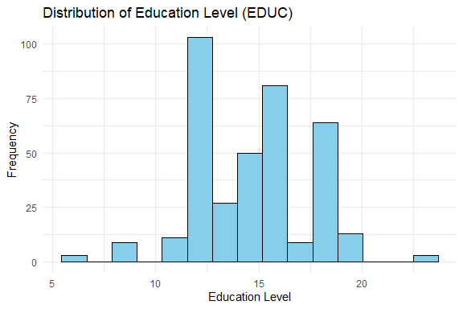
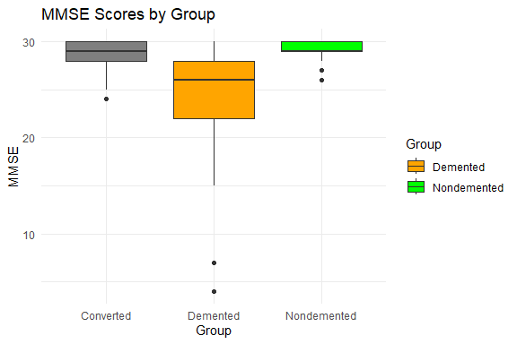
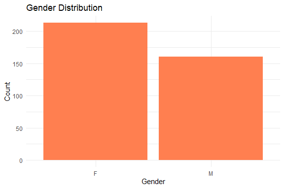
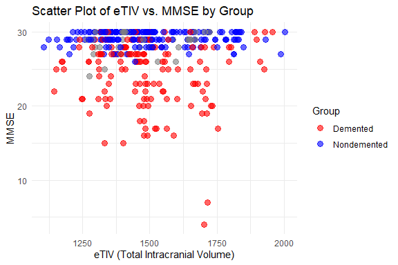
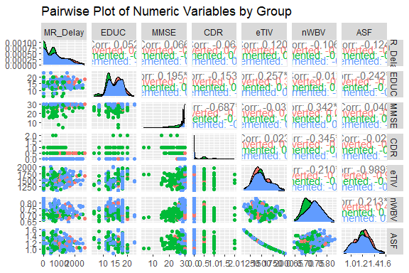
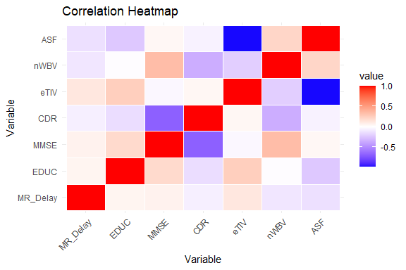
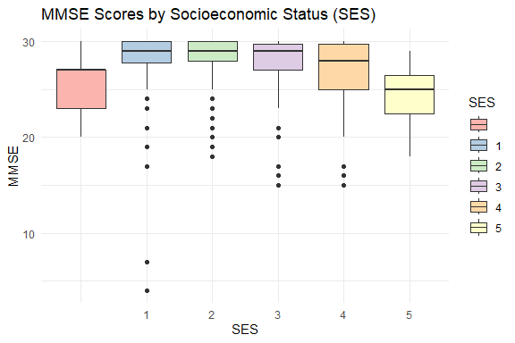
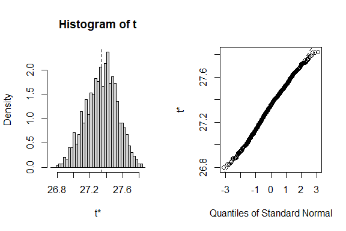

Demantia Prediction
================
Trevor Okinda
2024

- [Student Details](#student-details)
- [Setup Chunk](#setup-chunk)
  - [Source:](#source)
  - [Reference:](#reference)
- [Exploratory Data Analysis](#exploratory-data-analysis)
  - [Load dataset](#load-dataset)
  - [Measures of Frequency](#measures-of-frequency)
  - [Measures of Central Tendency](#measures-of-central-tendency)
  - [Measures of Relationship](#measures-of-relationship)
  - [Print Results](#print-results)
  - [ANOVA](#anova)
  - [Plots](#plots)
- [Preprocessing and Data
  Transformation](#preprocessing-and-data-transformation)
  - [Missing Values](#missing-values)
  - [Remove missing Values](#remove-missing-values)
- [Training Model](#training-model)
  - [Data Splitting](#data-splitting)
  - [Bootstrapping](#bootstrapping)
  - [Cross-validation](#cross-validation)
  - [Training Different Models](#training-different-models)
  - [Performance Comparison](#performance-comparison)
  - [Saving Model](#saving-model)

# Student Details

|                       |                             |
|-----------------------|-----------------------------|
| **Student ID Number** | 134780                      |
| **Student Name**      | Trevor Okinda               |
| **BBIT 4.2 Group**    | C                           |
| **Project Name**      | A Rainfall prediction model |

# Setup Chunk

**Note:** the following KnitR options have been set as the global
defaults: <BR>
`knitr::opts_chunk$set(echo = TRUE, warning = FALSE, eval = TRUE, collapse = FALSE, tidy = TRUE)`.

More KnitR options are documented here
<https://bookdown.org/yihui/rmarkdown-cookbook/chunk-options.html> and
here <https://yihui.org/knitr/options/>.

### Source:

The dataset that was used can be downloaded here: *\<<a
href="https://www.kaggle.com/datasets/shashwatwork/dementia-prediction-dataset\"
class="uri">https://www.kaggle.com/datasets/shashwatwork/dementia-prediction-dataset\</a>\>*

### Reference:

*\<Tiwari, S. (2019). Dementia Prediction Dataset \[Dataset\]. Kaggle.
<a
href="https://www.kaggle.com/datasets/shashwatwork/dementia-prediction-dataset\"
class="uri">https://www.kaggle.com/datasets/shashwatwork/dementia-prediction-dataset\</a>\>  
Refer to the APA 7th edition manual for rules on how to cite datasets:
<https://apastyle.apa.org/style-grammar-guidelines/references/examples/data-set-references>*

# Exploratory Data Analysis

## Load dataset

``` r
# Load necessary libraries
library(tidyverse)
```

    ## ── Attaching core tidyverse packages ──────────────────────── tidyverse 2.0.0 ──
    ## ✔ dplyr     1.1.4     ✔ readr     2.1.4
    ## ✔ forcats   1.0.0     ✔ stringr   1.5.0
    ## ✔ ggplot2   3.5.1     ✔ tibble    3.2.1
    ## ✔ lubridate 1.9.3     ✔ tidyr     1.3.0
    ## ✔ purrr     1.0.2     
    ## ── Conflicts ────────────────────────────────────────── tidyverse_conflicts() ──
    ## ✖ dplyr::filter() masks stats::filter()
    ## ✖ dplyr::lag()    masks stats::lag()
    ## ℹ Use the conflicted package (<http://conflicted.r-lib.org/>) to force all conflicts to become errors

``` r
# Load dataset
dementia_data <- read.csv("demantia.csv", colClasses = c(
  Group = "factor",        # Demented/Nondemented
  Visit = "factor",       # Visit number
  MR_Delay = "numeric",    # MR Delay
  Gender = "factor",          # M/F (Gender)
  Hand = "factor",         # Hand (Handedness)
  EDUC = "numeric",        # Education
  SES = "factor",         # Socioeconomic Status
  MMSE = "numeric",        # Mini-Mental State Examination
  CDR = "numeric",         # Clinical Dementia Rating
  eTIV = "numeric",        # Estimated Total Intracranial Volume
  nWBV = "numeric",        # Normalized Whole Brain Volume
  ASF = "numeric"          # Atlas Scaling Factor
))


# Display the structure of the dataset
str(dementia_data)
```

    ## 'data.frame':    373 obs. of  12 variables:
    ##  $ Group   : Factor w/ 3 levels "Converted","Demented",..: 3 3 2 2 2 3 3 3 3 3 ...
    ##  $ Visit   : Factor w/ 5 levels "1","2","3","4",..: 1 2 1 2 3 1 2 1 2 3 ...
    ##  $ MR_Delay: num  0 457 0 560 1895 ...
    ##  $ Gender  : Factor w/ 2 levels "F","M": 2 2 2 2 2 1 1 2 2 2 ...
    ##  $ Hand    : Factor w/ 1 level "R": 1 1 1 1 1 1 1 1 1 1 ...
    ##  $ EDUC    : num  14 14 12 12 12 18 18 12 12 12 ...
    ##  $ SES     : Factor w/ 6 levels "","1","2","3",..: 3 3 1 1 1 4 4 5 5 5 ...
    ##  $ MMSE    : num  27 30 23 28 22 28 27 28 29 30 ...
    ##  $ CDR     : num  0 0 0.5 0.5 0.5 0 0 0 0.5 0 ...
    ##  $ eTIV    : num  1987 2004 1678 1738 1698 ...
    ##  $ nWBV    : num  0.696 0.681 0.736 0.713 0.701 0.71 0.718 0.712 0.711 0.705 ...
    ##  $ ASF     : num  0.883 0.876 1.046 1.01 1.034 ...

``` r
# View the first few rows of the dataset
head(dementia_data)
```

    ##         Group Visit MR_Delay Gender Hand EDUC SES MMSE CDR eTIV  nWBV   ASF
    ## 1 Nondemented     1        0      M    R   14   2   27 0.0 1987 0.696 0.883
    ## 2 Nondemented     2      457      M    R   14   2   30 0.0 2004 0.681 0.876
    ## 3    Demented     1        0      M    R   12       23 0.5 1678 0.736 1.046
    ## 4    Demented     2      560      M    R   12       28 0.5 1738 0.713 1.010
    ## 5    Demented     3     1895      M    R   12       22 0.5 1698 0.701 1.034
    ## 6 Nondemented     1        0      F    R   18   3   28 0.0 1215 0.710 1.444

``` r
# View the dataset in a separate viewer window
View(dementia_data)
```

## Measures of Frequency

``` r
# Measures of Frequency
# Frequency of categorical variables
group_freq <- table(dementia_data$Group)
visit_freq <- table(dementia_data$Visit)
gender_freq <- table(dementia_data$Gender)
hand_freq <- table(dementia_data$Hand)
ses_freq <- table(dementia_data$SES)
```

## Measures of Central Tendency

``` r
# Measures of Central Tendency
# Mean, Median for numerical variables
mean_age <- mean(dementia_data$Age, na.rm = TRUE)
median_age <- median(dementia_data$Age, na.rm = TRUE)
mean_mmse <- mean(dementia_data$MMSE, na.rm = TRUE)
median_mmse <- median(dementia_data$MMSE, na.rm = TRUE)

# Mode function
get_mode <- function(v) {
  uniqv <- unique(v)
  uniqv[which.max(tabulate(match(v, uniqv)))]
}
mode_education <- get_mode(dementia_data$EDUC)
```

## Measures of Relationship

``` r
# Measures of Relationship
# Correlation matrix for numerical variables
cor_matrix <- cor(dementia_data %>% select(EDUC, MMSE, CDR, eTIV, nWBV, ASF), use = "complete.obs")

# Contingency table for categorical variables
group_gender_table <- table(dementia_data$Group, dementia_data$Gender)
```

## Print Results

``` r
# Print results
print("Frequency of Group:")
```

    ## [1] "Frequency of Group:"

``` r
print(group_freq)
```

    ## 
    ##   Converted    Demented Nondemented 
    ##          37         146         190

``` r
print("Frequency of Visit:")
```

    ## [1] "Frequency of Visit:"

``` r
print(visit_freq)
```

    ## 
    ##   1   2   3   4   5 
    ## 150 144  58  15   6

``` r
print("Frequency of Gender:")
```

    ## [1] "Frequency of Gender:"

``` r
print(gender_freq)
```

    ## 
    ##   F   M 
    ## 213 160

``` r
print("Frequency of Handedness:")
```

    ## [1] "Frequency of Handedness:"

``` r
print(hand_freq)
```

    ## 
    ##   R 
    ## 373

``` r
print("Frequency of SES:")
```

    ## [1] "Frequency of SES:"

``` r
print(ses_freq)
```

    ## 
    ##       1   2   3   4   5 
    ##  19  88 103  82  74   7

``` r
print(paste("Mean Age:", mean_age))
```

    ## [1] "Mean Age: NA"

``` r
print(paste("Median Age:", median_age))
```

    ## [1] "Median Age: "

``` r
print(paste("Mode Education:", mode_education))
```

    ## [1] "Mode Education: 12"

``` r
print(paste("Mean MMSE:", mean_mmse))
```

    ## [1] "Mean MMSE: 27.3423180592992"

``` r
print(paste("Median MMSE:", median_mmse))
```

    ## [1] "Median MMSE: 29"

``` r
print("Correlation Matrix:")
```

    ## [1] "Correlation Matrix:"

``` r
print(cor_matrix)
```

    ##            EDUC        MMSE         CDR        eTIV       nWBV         ASF
    ## EDUC  1.0000000  0.19488436 -0.14561447  0.25088721 -0.0111834 -0.23448371
    ## MMSE  0.1948844  1.00000000 -0.68651948 -0.03208381  0.3419124  0.04005216
    ## CDR  -0.1456145 -0.68651948  1.00000000  0.04245037 -0.3504728 -0.05376694
    ## eTIV  0.2508872 -0.03208381  0.04245037  1.00000000 -0.2099807 -0.98912256
    ## nWBV -0.0111834  0.34191241 -0.35047275 -0.20998073  1.0000000  0.21391424
    ## ASF  -0.2344837  0.04005216 -0.05376694 -0.98912256  0.2139142  1.00000000

``` r
print("Contingency Table of Group and Gender:")
```

    ## [1] "Contingency Table of Group and Gender:"

``` r
print(group_gender_table)
```

    ##              
    ##                 F   M
    ##   Converted    24  13
    ##   Demented     60  86
    ##   Nondemented 129  61

## ANOVA

``` r
# Load necessary libraries
library(tidyverse)
library(car)   # For Levene's Test
```

    ## Loading required package: carData

    ## 
    ## Attaching package: 'car'

    ## The following object is masked from 'package:dplyr':
    ## 
    ##     recode

    ## The following object is masked from 'package:purrr':
    ## 
    ##     some

``` r
library(psych) # For skewness and kurtosis
```

    ## 
    ## Attaching package: 'psych'

    ## The following object is masked from 'package:car':
    ## 
    ##     logit

    ## The following objects are masked from 'package:ggplot2':
    ## 
    ##     %+%, alpha

``` r
# Perform ANOVA

# Perform ANOVA on MMSE by Group
anova_mmse <- aov(MMSE ~ Group, data = dementia_data)
summary(anova_mmse)
```

    ##              Df Sum Sq Mean Sq F value Pr(>F)    
    ## Group         2   1892   946.1   111.3 <2e-16 ***
    ## Residuals   368   3127     8.5                   
    ## ---
    ## Signif. codes:  0 '***' 0.001 '**' 0.01 '*' 0.05 '.' 0.1 ' ' 1
    ## 2 observations deleted due to missingness

``` r
# Perform ANOVA on CDR by Group
anova_cdr <- aov(CDR ~ Group, data = dementia_data)
summary(anova_cdr)
```

    ##              Df Sum Sq Mean Sq F value Pr(>F)    
    ## Group         2  36.66  18.332   436.9 <2e-16 ***
    ## Residuals   370  15.52   0.042                   
    ## ---
    ## Signif. codes:  0 '***' 0.001 '**' 0.01 '*' 0.05 '.' 0.1 ' ' 1

``` r
# Check Assumptions for ANOVA
# 1. Homogeneity of Variances (Levene's Test)
leveneTest(MMSE ~ Group, data = dementia_data)
```

    ## Levene's Test for Homogeneity of Variance (center = median)
    ##        Df F value    Pr(>F)    
    ## group   2   66.16 < 2.2e-16 ***
    ##       368                      
    ## ---
    ## Signif. codes:  0 '***' 0.001 '**' 0.01 '*' 0.05 '.' 0.1 ' ' 1

``` r
leveneTest(CDR ~ Group, data = dementia_data)
```

    ## Levene's Test for Homogeneity of Variance (center = median)
    ##        Df F value    Pr(>F)    
    ## group   2  38.027 9.568e-16 ***
    ##       370                      
    ## ---
    ## Signif. codes:  0 '***' 0.001 '**' 0.01 '*' 0.05 '.' 0.1 ' ' 1

``` r
# 2. Normality of Residuals
shapiro.test(residuals(anova_mmse))
```

    ## 
    ##  Shapiro-Wilk normality test
    ## 
    ## data:  residuals(anova_mmse)
    ## W = 0.84229, p-value < 2.2e-16

``` r
shapiro.test(residuals(anova_cdr))
```

    ## 
    ##  Shapiro-Wilk normality test
    ## 
    ## data:  residuals(anova_cdr)
    ## W = 0.72397, p-value < 2.2e-16

``` r
# Post-hoc Analysis if ANOVA is significant
# Tukey's Honest Significant Difference (HSD) test
tukey_mmse <- TukeyHSD(anova_mmse)
tukey_cdr <- TukeyHSD(anova_cdr)

# Print results of post-hoc tests
print(tukey_mmse)
```

    ##   Tukey multiple comparisons of means
    ##     95% family-wise confidence level
    ## 
    ## Fit: aov(formula = MMSE ~ Group, data = dementia_data)
    ## 
    ## $Group
    ##                             diff        lwr       upr     p adj
    ## Demented-Converted    -4.1617868 -5.4261937 -2.897380 0.0000000
    ## Nondemented-Converted  0.5506401 -0.6820813  1.783362 0.5451059
    ## Nondemented-Demented   4.7124269  3.9544694  5.470384 0.0000000

``` r
print(tukey_cdr)
```

    ##   Tukey multiple comparisons of means
    ##     95% family-wise confidence level
    ## 
    ## Fit: aov(formula = CDR ~ Group, data = dementia_data)
    ## 
    ## $Group
    ##                             diff        lwr        upr p adj
    ## Demented-Converted     0.4144761  0.3257574  0.5031948     0
    ## Nondemented-Converted -0.2514936 -0.3381104 -0.1648768     0
    ## Nondemented-Demented  -0.6659697 -0.7190195 -0.6129200     0

## Plots

``` r
# Load necessary libraries
library(tidyverse)
library(GGally)  # For pairwise plots
```

    ## Registered S3 method overwritten by 'GGally':
    ##   method from   
    ##   +.gg   ggplot2

``` r
library(reshape2) # For melting data for the heatmap
```

    ## 
    ## Attaching package: 'reshape2'

    ## The following object is masked from 'package:tidyr':
    ## 
    ##     smiths

``` r
# Univariate Plots

# Histogram for EDUC (Education)
ggplot(dementia_data, aes(x = EDUC)) +
  geom_histogram(bins = 15, fill = "skyblue", color = "black") +
  labs(title = "Distribution of Education Level (EDUC)", x = "Education Level", y = "Frequency") +
  theme_minimal()
```

<!-- -->

``` r
# Boxplot for MMSE by Group
ggplot(dementia_data, aes(x = Group, y = MMSE, fill = Group)) +
  geom_boxplot() +
  labs(title = "MMSE Scores by Group", x = "Group", y = "MMSE") +
  theme_minimal() +
  scale_fill_manual(values = c("Demented" = "orange", "Nondemented" = "green"))
```

<!-- -->

``` r
# Bar plot for Gender Distribution
ggplot(dementia_data, aes(x = Gender)) +
  geom_bar(fill = "coral") +
  labs(title = "Gender Distribution", x = "Gender", y = "Count") +
  theme_minimal()
```

<!-- -->

``` r
# Multivariate Plots

# Scatter plot of MMSE vs. eTIV, colored by Group
ggplot(dementia_data, aes(x = eTIV, y = MMSE, color = Group)) +
  geom_point(alpha = 0.6, size = 3) +
  labs(title = "Scatter Plot of eTIV vs. MMSE by Group", x = "eTIV (Total Intracranial Volume)", y = "MMSE") +
  theme_minimal() +
  scale_color_manual(values = c("Demented" = "red", "Nondemented" = "blue"))
```

<!-- -->

``` r
# Pairwise plot for selected numerical variables
# Select only numeric columns for the pair plot
numeric_data <- dementia_data %>% select(MR_Delay, EDUC, MMSE, CDR, eTIV, nWBV, ASF)
ggpairs(numeric_data, aes(color = dementia_data$Group), title = "Pairwise Plot of Numeric Variables by Group")
```

<!-- -->

``` r
# Correlation heatmap
# Calculate correlations only for numeric columns
cor_data <- cor(numeric_data, use = "complete.obs")
# Melt correlation data for ggplot
melted_cor_data <- melt(cor_data)
ggplot(melted_cor_data, aes(Var1, Var2, fill = value)) +
  geom_tile(color = "white") +
  scale_fill_gradient2(low = "blue", high = "red", mid = "white", midpoint = 0) +
  theme_minimal() +
  labs(title = "Correlation Heatmap", x = "Variable", y = "Variable") +
  theme(axis.text.x = element_text(angle = 45, hjust = 1))
```

<!-- -->

``` r
# Box plot for MMSE across SES levels
ggplot(dementia_data, aes(x = SES, y = MMSE, fill = SES)) +
  geom_boxplot() +
  labs(title = "MMSE Scores by Socioeconomic Status (SES)", x = "SES", y = "MMSE") +
  theme_minimal() +
  scale_fill_brewer(palette = "Pastel1")
```

<!-- -->

# Preprocessing and Data Transformation

## Missing Values

``` r
# Load necessary library
library(tidyverse)

# Check for missing values in the dataset
# Summarize the number of missing values per column
missing_values_summary <- sapply(dementia_data, function(x) sum(is.na(x)))
print("Missing values per column:")
```

    ## [1] "Missing values per column:"

``` r
print(missing_values_summary)
```

    ##    Group    Visit MR_Delay   Gender     Hand     EDUC      SES     MMSE 
    ##        0        0        0        0        0        0        0        2 
    ##      CDR     eTIV     nWBV      ASF 
    ##        0        0        0        0

``` r
# Display a summary of missing values across the dataset
total_missing_values <- sum(is.na(dementia_data))
cat("Total missing values in the dataset:", total_missing_values, "\n")
```

    ## Total missing values in the dataset: 2

## Remove missing Values

``` r
# Visualize missing values using a heatmap
library(ggplot2)
library(naniar) # For visualizing missing data

# Plot missing data pattern
gg_miss_var(dementia_data) +
  labs(title = "Missing Data Pattern", x = "Variables", y = "Missing Count")
```

<!-- -->

``` r
# Show rows with missing values
missing_rows <- dementia_data[rowSums(is.na(dementia_data)) > 0, ]
print("Rows with missing values:")
```

    ## [1] "Rows with missing values:"

``` r
print(missing_rows)
```

    ##        Group Visit MR_Delay Gender Hand EDUC SES MMSE CDR eTIV  nWBV   ASF
    ## 358 Demented     2      539      F    R   12       NA   1 1169 0.742 1.501
    ## 359 Demented     3     1107      F    R   12       NA   1 1159 0.733 1.515

``` r
# Remove rows with missing values
dementia_data_clean <- na.omit(dementia_data)

# Confirm that there are no missing values in the cleaned dataset
sum(is.na(dementia_data_clean))  # Should return 0 if all missing values are removed
```

    ## [1] 0

``` r
# Display the cleaned dataset
head(dementia_data_clean)
```

    ##         Group Visit MR_Delay Gender Hand EDUC SES MMSE CDR eTIV  nWBV   ASF
    ## 1 Nondemented     1        0      M    R   14   2   27 0.0 1987 0.696 0.883
    ## 2 Nondemented     2      457      M    R   14   2   30 0.0 2004 0.681 0.876
    ## 3    Demented     1        0      M    R   12       23 0.5 1678 0.736 1.046
    ## 4    Demented     2      560      M    R   12       28 0.5 1738 0.713 1.010
    ## 5    Demented     3     1895      M    R   12       22 0.5 1698 0.701 1.034
    ## 6 Nondemented     1        0      F    R   18   3   28 0.0 1215 0.710 1.444

``` r
# Check the dimensions of the original vs cleaned dataset
cat("Original dataset dimensions:", dim(dementia_data), "\n")
```

    ## Original dataset dimensions: 373 12

``` r
cat("Cleaned dataset dimensions:", dim(dementia_data_clean), "\n")
```

    ## Cleaned dataset dimensions: 371 12

# Training Model

## Data Splitting

``` r
# Load necessary library
library(caret)
```

    ## Loading required package: lattice

    ## 
    ## Attaching package: 'caret'

    ## The following object is masked from 'package:purrr':
    ## 
    ##     lift

``` r
# Set seed for reproducibility
set.seed(123)

# Split the data: 70% for training, 30% for testing
train_index <- createDataPartition(dementia_data_clean$Group, p = 0.7, list = FALSE)
training_data <- dementia_data_clean[train_index, ]
testing_data <- dementia_data_clean[-train_index, ]

# Confirm the dimensions of the splits
cat("Training data dimensions:", dim(training_data), "\n")
```

    ## Training data dimensions: 260 12

``` r
cat("Testing data dimensions:", dim(testing_data), "\n")
```

    ## Testing data dimensions: 111 12

``` r
# Display the first few rows of each split
head(training_data)
```

    ##          Group Visit MR_Delay Gender Hand EDUC SES MMSE CDR eTIV  nWBV   ASF
    ## 1  Nondemented     1        0      M    R   14   2   27 0.0 1987 0.696 0.883
    ## 2  Nondemented     2      457      M    R   14   2   30 0.0 2004 0.681 0.876
    ## 7  Nondemented     2      538      F    R   18   3   27 0.0 1200 0.718 1.462
    ## 8  Nondemented     1        0      M    R   12   4   28 0.0 1689 0.712 1.039
    ## 9  Nondemented     2     1010      M    R   12   4   29 0.5 1701 0.711 1.032
    ## 10 Nondemented     3     1603      M    R   12   4   30 0.0 1699 0.705 1.033

``` r
head(testing_data)
```

    ##          Group Visit MR_Delay Gender Hand EDUC SES MMSE CDR eTIV  nWBV   ASF
    ## 3     Demented     1        0      M    R   12       23 0.5 1678 0.736 1.046
    ## 4     Demented     2      560      M    R   12       28 0.5 1738 0.713 1.010
    ## 5     Demented     3     1895      M    R   12       22 0.5 1698 0.701 1.034
    ## 6  Nondemented     1        0      F    R   18   3   28 0.0 1215 0.710 1.444
    ## 19    Demented     2      854      F    R   12   3   29 0.5 1482 0.752 1.184
    ## 25 Nondemented     3     1456      F    R   12   4   29 0.0 1225 0.710 1.433

## Bootstrapping

``` r
# Load necessary library
library(boot)
```

    ## 
    ## Attaching package: 'boot'

    ## The following object is masked from 'package:lattice':
    ## 
    ##     melanoma

    ## The following object is masked from 'package:psych':
    ## 
    ##     logit

    ## The following object is masked from 'package:car':
    ## 
    ##     logit

``` r
# Define a function to calculate the statistic (e.g., mean MMSE)
mean_mmse <- function(data, indices) {
  sample_data <- data[indices, ]  # Resample data with the given indices
  return(mean(sample_data$MMSE, na.rm = TRUE))  # Return the mean of MMSE
}

# Set seed for reproducibility
set.seed(123)

# Perform bootstrapping
# Using 1000 resamples to estimate the mean of MMSE
bootstrap_results <- boot(data = dementia_data_clean, statistic = mean_mmse, R = 1000)

# Display results
print(bootstrap_results)
```

    ## 
    ## ORDINARY NONPARAMETRIC BOOTSTRAP
    ## 
    ## 
    ## Call:
    ## boot(data = dementia_data_clean, statistic = mean_mmse, R = 1000)
    ## 
    ## 
    ## Bootstrap Statistics :
    ##     original       bias    std. error
    ## t1* 27.34232 -0.001897574   0.1926678

``` r
# Plot bootstrap results to visualize the distribution of the mean MMSE
plot(bootstrap_results)
```

<!-- -->

## Cross-validation

``` r
# Load necessary libraries
library(dplyr)
library(caret)
library(MLmetrics)
```

    ## 
    ## Attaching package: 'MLmetrics'

    ## The following objects are masked from 'package:caret':
    ## 
    ##     MAE, RMSE

    ## The following object is masked from 'package:psych':
    ## 
    ##     AUC

    ## The following object is masked from 'package:base':
    ## 
    ##     Recall

``` r
library(nnet)  # for multinom

# Drop 'Hand' column
dementia_data_clean <- dementia_data_clean %>% select(-Hand)

# Ensure 'Group' is a factor
dementia_data_clean$Group <- as.factor(dementia_data_clean$Group)

# Check levels (expecting 3)
levels(dementia_data_clean$Group)
```

    ## [1] "Converted"   "Demented"    "Nondemented"

``` r
# Set seed
set.seed(123)

# Define cross-validation settings
train_control <- trainControl(
  method = "cv",
  number = 10,
  classProbs = TRUE,
  summaryFunction = multiClassSummary,
  savePredictions = "final"
)

# Fit a multinomial logistic regression model
model_cv <- train(
  Group ~ ., 
  data = dementia_data_clean, 
  method = "multinom", 
  trControl = train_control,
  trace = FALSE  # suppress output
)

# Display results
print(model_cv)
```

    ## Penalized Multinomial Regression 
    ## 
    ## 371 samples
    ##  10 predictor
    ##   3 classes: 'Converted', 'Demented', 'Nondemented' 
    ## 
    ## No pre-processing
    ## Resampling: Cross-Validated (10 fold) 
    ## Summary of sample sizes: 333, 334, 334, 335, 333, 335, ... 
    ## Resampling results across tuning parameters:
    ## 
    ##   decay  logLoss    AUC        prAUC      Accuracy   Kappa      Mean_F1  
    ##   0e+00  0.6407509  0.9195070  0.6677865  0.8707444  0.7709177  0.7910830
    ##   1e-04  0.4965622  0.9233396  0.6948170  0.8787063  0.7837893  0.8029847
    ##   1e-01  0.2988298  0.9361156  0.7277347  0.9030346  0.8238245  0.8192565
    ##   Mean_Sensitivity  Mean_Specificity  Mean_Pos_Pred_Value  Mean_Neg_Pred_Value
    ##   0.7139808         0.9304588         0.7083495            0.9408633          
    ##   0.7198705         0.9334594         0.7405828            0.9459861          
    ##   0.7237928         0.9419131         0.8422265            0.9623475          
    ##   Mean_Precision  Mean_Recall  Mean_Detection_Rate  Mean_Balanced_Accuracy
    ##   0.7083495       0.7139808    0.2902481            0.8222198             
    ##   0.7405828       0.7198705    0.2929021            0.8266650             
    ##   0.8422265       0.7237928    0.3010115            0.8328530             
    ## 
    ## Accuracy was used to select the optimal model using the largest value.
    ## The final value used for the model was decay = 0.1.

``` r
print(model_cv$results)
```

    ##   decay   logLoss       AUC     prAUC  Accuracy     Kappa   Mean_F1
    ## 1 0e+00 0.6407509 0.9195070 0.6677865 0.8707444 0.7709177 0.7910830
    ## 2 1e-04 0.4965622 0.9233396 0.6948170 0.8787063 0.7837893 0.8029847
    ## 3 1e-01 0.2988298 0.9361156 0.7277347 0.9030346 0.8238245 0.8192565
    ##   Mean_Sensitivity Mean_Specificity Mean_Pos_Pred_Value Mean_Neg_Pred_Value
    ## 1        0.7139808        0.9304588           0.7083495           0.9408633
    ## 2        0.7198705        0.9334594           0.7405828           0.9459861
    ## 3        0.7237928        0.9419131           0.8422265           0.9623475
    ##   Mean_Precision Mean_Recall Mean_Detection_Rate Mean_Balanced_Accuracy
    ## 1      0.7083495   0.7139808           0.2902481              0.8222198
    ## 2      0.7405828   0.7198705           0.2929021              0.8266650
    ## 3      0.8422265   0.7237928           0.3010115              0.8328530
    ##    logLossSD      AUCSD    prAUCSD AccuracySD    KappaSD  Mean_F1SD
    ## 1 0.49602714 0.04261439 0.06738048 0.04574689 0.08107488 0.10325748
    ## 2 0.28819673 0.04030233 0.05254365 0.04091634 0.07329326 0.08730305
    ## 3 0.07715412 0.05268224 0.06389655 0.03432164 0.06359207 0.07677630
    ##   Mean_SensitivitySD Mean_SpecificitySD Mean_Pos_Pred_ValueSD
    ## 1         0.12209479         0.02625864             0.1175705
    ## 2         0.11760421         0.02434428             0.1514626
    ## 3         0.09573835         0.01974703             0.1618300
    ##   Mean_Neg_Pred_ValueSD Mean_PrecisionSD Mean_RecallSD Mean_Detection_RateSD
    ## 1            0.02191751        0.1175705    0.12209479            0.01524896
    ## 2            0.02073953        0.1514626    0.11760421            0.01363878
    ## 3            0.01477417        0.1618300    0.09573835            0.01144055
    ##   Mean_Balanced_AccuracySD
    ## 1               0.07309191
    ## 2               0.06988441
    ## 3               0.05671796

## Training Different Models

``` r
# Load necessary libraries
library(dplyr)
library(caret)
library(MLmetrics)

# Remove the 'Hand' column from the dataset
if ("Hand" %in% colnames(dementia_data_clean)) {
  dementia_data_clean <- dementia_data_clean %>% select(-Hand)
}


# Check the structure of the cleaned dataset
str(dementia_data_clean)
```

    ## 'data.frame':    371 obs. of  11 variables:
    ##  $ Group   : Factor w/ 3 levels "Converted","Demented",..: 3 3 2 2 2 3 3 3 3 3 ...
    ##  $ Visit   : Factor w/ 5 levels "1","2","3","4",..: 1 2 1 2 3 1 2 1 2 3 ...
    ##  $ MR_Delay: num  0 457 0 560 1895 ...
    ##  $ Gender  : Factor w/ 2 levels "F","M": 2 2 2 2 2 1 1 2 2 2 ...
    ##  $ EDUC    : num  14 14 12 12 12 18 18 12 12 12 ...
    ##  $ SES     : Factor w/ 6 levels "","1","2","3",..: 3 3 1 1 1 4 4 5 5 5 ...
    ##  $ MMSE    : num  27 30 23 28 22 28 27 28 29 30 ...
    ##  $ CDR     : num  0 0 0.5 0.5 0.5 0 0 0 0.5 0 ...
    ##  $ eTIV    : num  1987 2004 1678 1738 1698 ...
    ##  $ nWBV    : num  0.696 0.681 0.736 0.713 0.701 0.71 0.718 0.712 0.711 0.705 ...
    ##  $ ASF     : num  0.883 0.876 1.046 1.01 1.034 ...
    ##  - attr(*, "na.action")= 'omit' Named int [1:2] 358 359
    ##   ..- attr(*, "names")= chr [1:2] "358" "359"

``` r
# Set seed for reproducibility
set.seed(123)

# Define cross-validation settings
train_control <- trainControl(
  method = "cv", 
  number = 10, 
  classProbs = TRUE,
  summaryFunction = multiClassSummary
)

# K-Nearest Neighbors Model
knn_model <- train(
  Group ~ ., 
  data = dementia_data_clean, 
  method = "knn", 
  trControl = train_control,
  tuneLength = 10  # Search for the optimal value of k
)

# Random Forest Model
rf_model <- train(
  Group ~ ., 
  data = dementia_data_clean, 
  method = "rf", 
  trControl = train_control
)

# Support Vector Machine Model
svm_model <- train(
  Group ~ ., 
  data = dementia_data_clean, 
  method = "svmRadial", 
  trControl = train_control
)

# Display results of each model
cat("K-Nearest Neighbors Model:\n")
```

    ## K-Nearest Neighbors Model:

``` r
print(knn_model$results)
```

    ##     k  logLoss       AUC     prAUC  Accuracy      Kappa  Mean_F1
    ## 1   5 4.998226 0.5082380 0.3050466 0.4955824 0.06918522 0.354884
    ## 2   7 3.229034 0.5189424 0.3322256 0.4978465 0.06329806      NaN
    ## 3   9 2.264386 0.5274472 0.3334483 0.5139995 0.09064633      NaN
    ## 4  11 1.821046 0.5408728 0.3347914 0.5167734 0.09428307      NaN
    ## 5  13 1.710929 0.5594839 0.3564405 0.5005571 0.05880218      NaN
    ## 6  15 1.719713 0.5494256 0.3522775 0.4952900 0.04910966      NaN
    ## 7  17 1.467770 0.5483265 0.3533304 0.4977794 0.05560045      NaN
    ## 8  19 1.299422 0.5550725 0.3501839 0.5028212 0.06356659      NaN
    ## 9  21 1.208126 0.5620832 0.3593250 0.4950767 0.05569103      NaN
    ## 10 23 1.208114 0.5648669 0.3565038 0.4920025 0.05151091      NaN
    ##    Mean_Sensitivity Mean_Specificity Mean_Pos_Pred_Value Mean_Neg_Pred_Value
    ## 1         0.3675439        0.6884865           0.3602093           0.6903733
    ## 2         0.3578613        0.6873461           0.3485477           0.6893379
    ## 3         0.3683876        0.6970624           0.3988889           0.7009821
    ## 4         0.3707686        0.6970346           0.3678419           0.7027767
    ## 5         0.3572682        0.6853091                 NaN           0.6914403
    ## 6         0.3543860        0.6819394                 NaN           0.6838338
    ## 7         0.3570844        0.6840735                 NaN           0.6898570
    ## 8         0.3602757        0.6868934                 NaN           0.6914607
    ## 9         0.3570426        0.6839080                 NaN           0.6882395
    ## 10        0.3554470        0.6823586                 NaN           0.6870336
    ##    Mean_Precision Mean_Recall Mean_Detection_Rate Mean_Balanced_Accuracy
    ## 1       0.3602093   0.3675439           0.1651941              0.5280152
    ## 2       0.3485477   0.3578613           0.1659488              0.5226037
    ## 3       0.3988889   0.3683876           0.1713332              0.5327250
    ## 4       0.3678419   0.3707686           0.1722578              0.5339016
    ## 5             NaN   0.3572682           0.1668524              0.5212886
    ## 6             NaN   0.3543860           0.1650967              0.5181627
    ## 7             NaN   0.3570844           0.1659265              0.5205790
    ## 8             NaN   0.3602757           0.1676071              0.5235845
    ## 9             NaN   0.3570426           0.1650256              0.5204753
    ## 10            NaN   0.3554470           0.1640008              0.5189028
    ##    logLossSD      AUCSD    prAUCSD AccuracySD   KappaSD  Mean_F1SD
    ## 1  1.0125000 0.05885717 0.02693277 0.06821027 0.1168377 0.06311295
    ## 2  1.0450141 0.07023711 0.03800555 0.07531013 0.1527927         NA
    ## 3  1.0403184 0.08504802 0.05150807 0.10175302 0.1999022         NA
    ## 4  0.8261791 0.07520583 0.03707588 0.07512528 0.1423431         NA
    ## 5  0.8699307 0.07600426 0.04176626 0.10310070 0.1938333         NA
    ## 6  0.8660226 0.07801522 0.05893279 0.07635133 0.1472925         NA
    ## 7  0.7511754 0.07922671 0.06324786 0.06624834 0.1289912         NA
    ## 8  0.6459725 0.08765943 0.05669703 0.09707152 0.1872875         NA
    ## 9  0.6275569 0.09278079 0.05624877 0.09861084 0.1825420         NA
    ## 10 0.6288890 0.09653294 0.05526838 0.08971092 0.1645836         NA
    ##    Mean_SensitivitySD Mean_SpecificitySD Mean_Pos_Pred_ValueSD
    ## 1          0.04182179         0.03967375            0.03815298
    ## 2          0.06192481         0.05003810            0.04767873
    ## 3          0.07938045         0.06587485            0.01414214
    ## 4          0.05693059         0.04631104            0.14701173
    ## 5          0.07721084         0.06315569                    NA
    ## 6          0.05827343         0.04852137                    NA
    ## 7          0.05187606         0.04167965                    NA
    ## 8          0.07631258         0.06093479                    NA
    ## 9          0.07373345         0.06057884                    NA
    ## 10         0.06726361         0.05355315                    NA
    ##    Mean_Neg_Pred_ValueSD Mean_PrecisionSD Mean_RecallSD Mean_Detection_RateSD
    ## 1             0.04453679       0.03815298    0.04182179            0.02273676
    ## 2             0.05772476       0.04767873    0.06192481            0.02510338
    ## 3             0.07799194       0.01414214    0.07938045            0.03391767
    ## 4             0.05584877       0.14701173    0.05693059            0.02504176
    ## 5             0.08195014               NA    0.07721084            0.03436690
    ## 6             0.05878033               NA    0.05827343            0.02545044
    ## 7             0.05950449               NA    0.05187606            0.02208278
    ## 8             0.07318357               NA    0.07631258            0.03235717
    ## 9             0.07272317               NA    0.07373345            0.03287028
    ## 10            0.06347971               NA    0.06726361            0.02990364
    ##    Mean_Balanced_AccuracySD
    ## 1                0.03977244
    ## 2                0.05594342
    ## 3                0.07253093
    ## 4                0.05158452
    ## 5                0.07017306
    ## 6                0.05337020
    ## 7                0.04675233
    ## 8                0.06859884
    ## 9                0.06711450
    ## 10               0.06037422

``` r
cat("\nRandom Forest Model:\n")
```

    ## 
    ## Random Forest Model:

``` r
print(rf_model$results)
```

    ##   mtry   logLoss       AUC     prAUC  Accuracy     Kappa   Mean_F1
    ## 1    2 0.3786541 0.9505400 0.7350768 0.9057531 0.8280532 0.7829091
    ## 2    9 0.2955037 0.9170388 0.6830763 0.9003438 0.8197897 0.7836456
    ## 3   17 0.4164712 0.9060109 0.6025653 0.8951557 0.8132986 0.7811663
    ##   Mean_Sensitivity Mean_Specificity Mean_Pos_Pred_Value Mean_Neg_Pred_Value
    ## 1        0.7086257        0.9424406           0.9204338           0.9648081
    ## 2        0.7188638        0.9417292           0.8336451           0.9604036
    ## 3        0.7336884        0.9411751           0.8233910           0.9558428
    ##   Mean_Precision Mean_Recall Mean_Detection_Rate Mean_Balanced_Accuracy
    ## 1      0.9204338   0.7086257           0.3019177              0.8255332
    ## 2      0.8336451   0.7188638           0.3001146              0.8302965
    ## 3      0.8233910   0.7336884           0.2983852              0.8374317
    ##   logLossSD      AUCSD    prAUCSD AccuracySD    KappaSD  Mean_F1SD
    ## 1 0.0567637 0.04243291 0.05035337 0.02894930 0.05291965 0.03341374
    ## 2 0.0841362 0.05745556 0.05860424 0.03105758 0.05663379 0.02985266
    ## 3 0.2897925 0.05753231 0.07078220 0.03619710 0.06316053 0.02967564
    ##   Mean_SensitivitySD Mean_SpecificitySD Mean_Pos_Pred_ValueSD
    ## 1         0.05366402         0.01751682            0.08131477
    ## 2         0.06058303         0.01907252            0.13617337
    ## 3         0.06674311         0.01982929            0.13172313
    ##   Mean_Neg_Pred_ValueSD Mean_PrecisionSD Mean_RecallSD Mean_Detection_RateSD
    ## 1            0.01427097       0.08131477    0.05366402           0.009649767
    ## 2            0.01499403       0.13617337    0.06058303           0.010352526
    ## 3            0.01999115       0.13172313    0.06674311           0.012065700
    ##   Mean_Balanced_AccuracySD
    ## 1               0.03436674
    ## 2               0.03908853
    ## 3               0.04152058

``` r
cat("\nSupport Vector Machine Model:\n")
```

    ## 
    ## Support Vector Machine Model:

``` r
print(svm_model$results)
```

    ##        sigma    C   logLoss       AUC     prAUC  Accuracy     Kappa   Mean_F1
    ## 1 0.04282072 0.25 0.3868796 0.9225191 0.6943095 0.8630038 0.7577337 0.7318069
    ## 2 0.04282072 0.50 0.3572422 0.9252361 0.6930382 0.8630038 0.7570951 0.7307700
    ## 3 0.04282072 1.00 0.3452524 0.9278821 0.6998097 0.8737474 0.7739229 0.7696517
    ##   Mean_Sensitivity Mean_Specificity Mean_Pos_Pred_Value Mean_Neg_Pred_Value
    ## 1        0.6882414        0.9242097           0.7296574           0.9391110
    ## 2        0.6877736        0.9242097           0.7274528           0.9388863
    ## 3        0.6907101        0.9276921           0.7361884           0.9453806
    ##   Mean_Precision Mean_Recall Mean_Detection_Rate Mean_Balanced_Accuracy
    ## 1      0.7296574   0.6882414           0.2876679              0.8062256
    ## 2      0.7274528   0.6877736           0.2876679              0.8059917
    ## 3      0.7361884   0.6907101           0.2912491              0.8092011
    ##    logLossSD      AUCSD    prAUCSD AccuracySD    KappaSD  Mean_F1SD
    ## 1 0.11538973 0.04516004 0.06004170 0.05259377 0.08282708 0.06842990
    ## 2 0.07546728 0.04414917 0.05297909 0.04637382 0.07502316 0.06476997
    ## 3 0.08165887 0.04304064 0.05319627 0.04932182 0.08286639 0.05551042
    ##   Mean_SensitivitySD Mean_SpecificitySD Mean_Pos_Pred_ValueSD
    ## 1         0.07440268         0.02406050             0.1383505
    ## 2         0.07252402         0.02213374             0.1381151
    ## 3         0.08385390         0.02498930             0.1505994
    ##   Mean_Neg_Pred_ValueSD Mean_PrecisionSD Mean_RecallSD Mean_Detection_RateSD
    ## 1            0.02819420        0.1383505    0.07440268            0.01753126
    ## 2            0.02546758        0.1381151    0.07252402            0.01545794
    ## 3            0.02429055        0.1505994    0.08385390            0.01644061
    ##   Mean_Balanced_AccuracySD
    ## 1               0.04801084
    ## 2               0.04622310
    ## 3               0.05377939

## Performance Comparison

``` r
# Combine the results of the models
model_list <- resamples(list(KNN = knn_model, RF = rf_model, SVM = svm_model))

# Summarize the results
summary(model_list)
```

    ## 
    ## Call:
    ## summary.resamples(object = model_list)
    ## 
    ## Models: KNN, RF, SVM 
    ## Number of resamples: 10 
    ## 
    ## Accuracy 
    ##          Min.   1st Qu.    Median      Mean   3rd Qu.      Max. NA's
    ## KNN 0.4054054 0.4626502 0.5135135 0.5167734 0.5723684 0.6486486    0
    ## RF  0.8648649 0.8918919 0.9068279 0.9057531 0.9205192 0.9459459    0
    ## SVM 0.7631579 0.8648649 0.8783784 0.8737474 0.8940256 0.9444444    0
    ## 
    ## AUC 
    ##          Min.   1st Qu.    Median      Mean   3rd Qu.      Max. NA's
    ## KNN 0.3987281 0.5074989 0.5431267 0.5408728 0.5888614 0.6600463    0
    ## RF  0.8517143 0.9557487 0.9638271 0.9505400 0.9718324 0.9922340    0
    ## SVM 0.8689318 0.8891284 0.9361857 0.9278821 0.9531537 0.9869145    0
    ## 
    ## Kappa 
    ##            Min.      1st Qu.    Median       Mean   3rd Qu.      Max. NA's
    ## KNN -0.09851552 -0.007417419 0.0947254 0.09428307 0.1950531 0.3337950    0
    ## RF   0.75033738  0.802264635 0.8317040 0.82805323 0.8567932 0.9002695    0
    ## SVM  0.60139860  0.750814621 0.7778730 0.77392294 0.8119912 0.9013699    0
    ## 
    ## logLoss 
    ##          Min.   1st Qu.    Median      Mean   3rd Qu.      Max. NA's
    ## KNN 0.9071130 0.9915333 1.7498389 1.8210460 2.6601848 2.7895764    0
    ## RF  0.2718488 0.3502362 0.3759595 0.3786541 0.4306548 0.4477437    0
    ## SVM 0.2192980 0.3094843 0.3583070 0.3452524 0.3666018 0.4895000    0
    ## 
    ## Mean_Balanced_Accuracy 
    ##          Min.   1st Qu.    Median      Mean   3rd Qu.      Max. NA's
    ## KNN 0.4607184 0.4974660 0.5349001 0.5339016 0.5706967 0.6165937    0
    ## RF  0.7802780 0.8013285 0.8234920 0.8255332 0.8509884 0.8703704    0
    ## SVM 0.7321084 0.7742634 0.8032032 0.8092011 0.8354719 0.9199134    0
    ## 
    ## Mean_Detection_Rate 
    ##          Min.   1st Qu.    Median      Mean   3rd Qu.      Max. NA's
    ## KNN 0.1351351 0.1542167 0.1711712 0.1722578 0.1907895 0.2162162    0
    ## RF  0.2882883 0.2972973 0.3022760 0.3019177 0.3068397 0.3153153    0
    ## SVM 0.2543860 0.2882883 0.2927928 0.2912491 0.2980085 0.3148148    0
    ## 
    ## Mean_F1 
    ##          Min.   1st Qu.    Median      Mean   3rd Qu.      Max. NA's
    ## KNN        NA        NA        NA       NaN        NA        NA   10
    ## RF  0.7394006 0.7692308 0.7725806 0.7829091 0.8166667 0.8166667    5
    ## SVM 0.7326542 0.7373016 0.7413841 0.7696517 0.7718391 0.8650794    5
    ## 
    ## Mean_Neg_Pred_Value 
    ##          Min.   1st Qu.    Median      Mean   3rd Qu.      Max. NA's
    ## KNN 0.6245014 0.6629687 0.7048439 0.7027767 0.7409992 0.7948934    0
    ## RF  0.9417417 0.9569998 0.9680931 0.9648081 0.9729730 0.9814815    0
    ## SVM 0.8883205 0.9369213 0.9476882 0.9453806 0.9561278 0.9747475    0
    ## 
    ## Mean_Pos_Pred_Value 
    ##          Min.   1st Qu.    Median      Mean   3rd Qu.      Max. NA's
    ## KNN 0.2638889 0.3158654 0.3678419 0.3678419 0.4198184 0.4717949    8
    ## RF  0.7765738 0.9416667 0.9474206 0.9204338 0.9682540 0.9682540    5
    ## SVM 0.5742690 0.5968254 0.7777778 0.7361884 0.8650794 0.9460317    1
    ## 
    ## Mean_Precision 
    ##          Min.   1st Qu.    Median      Mean   3rd Qu.      Max. NA's
    ## KNN 0.2638889 0.3158654 0.3678419 0.3678419 0.4198184 0.4717949    8
    ## RF  0.7765738 0.9416667 0.9474206 0.9204338 0.9682540 0.9682540    5
    ## SVM 0.5742690 0.5968254 0.7777778 0.7361884 0.8650794 0.9460317    1
    ## 
    ## Mean_Recall 
    ##          Min.   1st Qu.    Median      Mean   3rd Qu.      Max. NA's
    ## KNN 0.2882206 0.3311404 0.3709273 0.3707686 0.4119883 0.4584795    0
    ## RF  0.6491228 0.6666667 0.6995614 0.7086257 0.7500000 0.7777778    0
    ## SVM 0.5789474 0.6289474 0.6820175 0.6907101 0.7308897 0.8650794    0
    ## 
    ## Mean_Sensitivity 
    ##          Min.   1st Qu.    Median      Mean   3rd Qu.      Max. NA's
    ## KNN 0.2882206 0.3311404 0.3709273 0.3707686 0.4119883 0.4584795    0
    ## RF  0.6491228 0.6666667 0.6995614 0.7086257 0.7500000 0.7777778    0
    ## SVM 0.5789474 0.6289474 0.6820175 0.6907101 0.7308897 0.8650794    0
    ## 
    ## Mean_Specificity 
    ##          Min.   1st Qu.    Median      Mean   3rd Qu.      Max. NA's
    ## KNN 0.6332162 0.6637916 0.6988728 0.6970346 0.7294050 0.7747079    0
    ## RF  0.9114332 0.9359903 0.9470431 0.9424406 0.9521666 0.9629630    0
    ## SVM 0.8852694 0.9194858 0.9245718 0.9276921 0.9400540 0.9747475    0
    ## 
    ## prAUC 
    ##          Min.   1st Qu.    Median      Mean   3rd Qu.      Max. NA's
    ## KNN 0.2632288 0.3077596 0.3450559 0.3347914 0.3656759 0.3735247    0
    ## RF  0.6172962 0.7190952 0.7543553 0.7350768 0.7662765 0.7878362    0
    ## SVM 0.6345522 0.6595095 0.6914629 0.6998097 0.7253792 0.8037644    0

``` r
# Plot the comparison of model performance
bwplot(model_list, metric = "Accuracy")  # You can change 'Accuracy' to other metrics like 'Kappa' if needed
```

<!-- -->

## Saving Model

``` r
# Load the saved model
loaded_rf_model <- readRDS("./models/saved_rf_model.rds")

# Example new data for prediction (replace values with actual test data as needed)
new_data <- data.frame(
  Visit = factor(1),
  MR_Delay = 0,
  Gender = factor("M"),
  EDUC = 16,
  SES = factor(2),
  MMSE = 28,
  CDR = 0.5,
  eTIV = 1500,
  nWBV = 0.7,
  ASF = 1.05
)

# Use the loaded model to make predictions
predictions_loaded_model <- predict(loaded_rf_model, newdata = new_data)

# Print predictions
print(predictions_loaded_model)
```

    ## [1] Demented
    ## Levels: Converted Demented Nondemented
